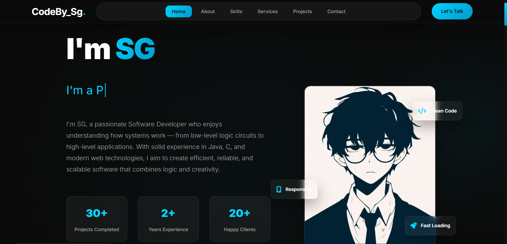

# 🌐 Modern Portfolio Website



A sleek, responsive, and interactive personal portfolio website built using **HTML**, **CSS**, and **JavaScript**.  
Designed to showcase your skills, projects, and experience with elegant animations and smooth user interactions.

---

## 🔗 Live Demo
You can preview the portfolio locally by opening `index.html` in a modern browser.  
Or access the online demo here: [Live Demo]((https://hirugamage.github.io/dev-portfolio.01.demo/))

---

## 🧰 Tools & Technologies
| Category | Tools Used |
|-----------|-------------|
| **Frontend** | HTML5, CSS3, JavaScript (ES6) |
| **Styling** | Flexbox, Grid, Transitions, Keyframes |
| **Icons** | Font Awesome / Boxicons |
| **Typography** | Google Fonts |
| **Animations** | Vanilla JS + CSS Animations |
| **Version Control** | Git & GitHub |
| **Deployment** | GitHub Pages |

---

## 🧠 Customization
You can easily customize the project by:
- Editing your name, bio, and project details in `index.html`
- Changing theme colors and fonts in `style.css`
- Replacing the logo in `profile/images/logo.png`
- Adjusting typing speed, animation timing, and scroll effects in `script.js`

> 💡 Tip: Update the meta description and keywords in the `<head>` tag of `index.html` for better SEO.

---

## 📂 Project Structure

```bash
📦 modern-portfolio-website
 ┣ 📜 index.html          # Main HTML file
 ┣ 📜 style.css           # Website styling
 ┣ 📜 script.js           # Main JavaScript file
 ┣ 📂 assets              # Folder containing all assets
 ┃ ┣ 📂 images            # Images and logos
 ┃ ┣ 📂 icons             # SVGs or icons
 ┃ ┗ 📂 fonts             # Custom fonts (optional)
 ┗ 📜 README.md           # Project documentation
```
---


## 📬 Contact
  
- GitHub: [GitHub](https://github.com/hirugamage)  


---

Made with ❤️ by **SG**
